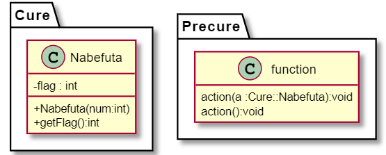

ここでは、今回のコードを説明をしていきます。

(技術情報)

```
C:\Users\XXXX\precure_reproduct>g++ --version 
g++ (MinGW.org GCC Build-2) 9.2.0
...(略)
```

(プログラムの全体図)



### class Cure::Nabefuta

#### flag

他からは参照できない、`int`型のフィールド(変数)です。

#### Nabefuta(num:int)

他からも参照できる、コンストラクタです。変数として、`int`型の引数:numを受け取ります。

#### getFlag():int

他からも参照できる、メソッド(関数)です。返り値として、`int`型を返します。

### class Precure::function

このクラスは、実際にはありません。(直に書いたため、形式的に使っています。)

#### action(a:Cure::Nabefuta):void

引数として、`Cure::Nabefuta`型の引数:aを受け取ります。返り値はありません。

#### action():void

引数はありません。返り値もありません。

(プログラムの解説)

### CureNabefuta.hpp

最初と最後の`#`で囲まれた部分

```cpp
#ifndef PRECURE
#define PRECURE 1
...

#endif
```

いわゆるインクルードガードです。

ヘッダファイルは`#include (ファイル名)`と書くことでこの部分に(ファイル名)の部分にファイル名のコードがそのまま貼り付けられるようになっているのですが、これがあることで、初めて読み込むときだけ読み込まれ、それ以降はスキップされます。

もしこのインクルードガードがないときに、同じヘッダファイルををインクルードすると、次のようなエラーが出ます。

```cpp
//test.cpp
#include <CureNabefuta.hpp>
#include <CureNabefuta.hpp>
int main() {
    //何もしない
}
```

(ターミナルの出力)
```
C:\Users\nabe_\Documents\GitHub\precure_reproduct>g++ test.cpp -I .
In file included from test.cpp:2:
./CureNabefuta.hpp:4:7: error: redefinition of 'class Cure::Nabefuta'
    4 | class Nabefuta {
      |       ^~~~~~~~
In file included from test.cpp:1:
./CureNabefuta.hpp:4:7: note: previous definition of 'class Cure::Nabefuta'
    4 | class Nabefuta {
      |       ^~~~~~~~
```
ここでの、`g++ test.cpp -I .`はこのような意味を持っています。

- g++ :コンパイラ(=コードをパソコンが読める言語に変換するもの)の種類、c++の場合はg++

- test.cpp :コンパイルするファイル名

- -I . :インクルードファイルの場所を追加するオプション。次にある`.`は現在のディレクトリを表す

また、ターミナルの出力の出力にある`redefinition`とは、再定義(=re + define + tion)と言う意味です。
つまり、コンパイラはclass Cure::Nabefutaというクラス、もう一回定義しているぞ、というエラーを吐いています。

では、このインクルードガードについて、詳しく見ていきましょう。

- 1行目: `#ifndef PRECURE`

この行では、`PRECURE`という物(マクロと言います)が定義されいないかを判断する文です。
もし、`PRECURE`というマクロが定義されていなければ、そのまま次の行に進み、定義されていれば、17行目の`#endif`に飛びます。

- 2行目: `#define PRECURE 1`

ここでは、`PRECURE`というマクロを定義しています。

これによって、1回目のインクルードでは、1行目はそのまま進み、2行目で、`PRECURE`が定義されるので、2回目以降は、1行目で飛ばれます。

- 4,13行: `namespace (名前){ ... }`

ここでは、中に書かれた関数などについて、前書きのような物を追加しています。

(例えば、自由の女神、とだけ言うと、ニューヨークにある物か、フランスにある物か区別がつきませんが、
ニューヨークの自由の女神というと、どんな物かがはっきり決まります。この場合、ニューヨークのというところがnamespaceの部分に当たります。)

namespaceの中にある関数などを使うときは、同じnamespaceの中で使うときは、いつも通り使えますが、外で使う時は、
`(名前)::(関数名など)`というようにして使う必要があります。

- 4~11行目:`class Nabefuta`

ここからがメインのクラス部分です。

クラスとは、複数のメソッドやフィールドをまとめた扱える物です。

- 5~8行目:`private:`

ここにかかれた物は、特別な場合を除いて、同じクラスのなかでしか扱えません。

ここでは、`int`型のフィールド:flagが該当します。

- 9~10行目:`public`
ここにかかれた物は、どこからでも呼び出すことができます。

ここでは、コンストラクタと、`int`型を帰すメソッド:getFlag(引数はなし)が該当します。

- 9行目:`Nabefuta(int num);`

これは引数があるため、一見、メソッドにみえますが、返り値の型がなく、最初に呼びだされる関数であるコンストラクタです。

- 10行目:`int getFlag();`

メソッドです。
しかし、メソッドを使うことで、外からでもprivateなフィールドの値を読み取ったり、書き込むことができるため、
それぞれ、`getter`、`setter`(これらをまとめて`accessor`)と呼ばれます。

- 14行目: `void action(void);`

ただの関数です。

引数がなければ、返り値もありません。

- 15行目:`void action(Cure::Nabefuta& a);`

これも関数です。

返り値はありませんが、引数は前のと違って、`Cure::Nabefuta` のaとなっています。

`Cure::Nabefuta`のあとに`&`がありますが、これは
参照渡しといって、値を渡す参照渡しとアドレス(値の格納場所)を渡すポインタ渡しのいいとこ取りをした物です。

具体的に言うと、関数を呼び出すときは`func(name)`のように値を渡すだけで良くて、しかも、関数内で値の書き換えができ、
さらに、引数として無効なポインタを渡すことができないという特徴があります。

また、これらの関数は名前は同じなので、エラーが出るのでは？と言う人もいますが、C++の場合、引数が違えば、関数名が同じでも
区別することがでるため、呼び出すことができます。(これを`overload`:オーバーロードと呼びます。)

また、ここでは、関数のくわしい処理について書かれていませんが、これは、ヘッダファイルが一番最初にくるためです。

(このように、関数の引数や返り値のみを書いておくのをプロトタイプ宣言と呼びます。)

### CureNabefuta.cpp

ここでは、`CureNabefuta.hpp`で宣言した関数の処理について書かれています。

- 1,2行目: `#include ...`

ファイルをインクルードしています。
1行目は、先ほど書いた、`CureNabefuta.hpp`を、

2行目は、標準入手出力についての関数が書かれたファイル:`istream`をインクルードしています。

- 4~7行目: `Cure::Nabefuta::Nabefuta(int num){...}`

ここでは、namespace:`Cure`にあるクラス:`Nabefuta`のコンストラクタの処理を書いたものです。

- 5行目:`this->flag = num;`

ここでの`this`とは、クラスのアドレスが格納されています。

また、`this->flag`は、`this`というポインタの中身にある`flag`というフィールドを指しています。

- 6行目:`std::cout << "num :" << this->flag << std::endl;`

出力部分です。

`std::cout`とは、標準出力に結びついたもので、`<<`で複数の情報を結びつけています。

また、`std::endl`は主に改行を意味しています。

- 8行目:`int Cure::Nabefuta::getFlag() { ...}`

namespace:`Cure`にあるクラス:`Nabefuta`のメソッド:`int getFlag()`の処理を書いたものです。

同じクラスにある`flag`を返します。

- 10行目:`void Precure::action(void){...}`
  
namespace:`Precure`にある関数:`void action(void)`の内容を書いたものです。

処理の内容については割愛します。

- 11~13行目:`void Precure::action(Cure::Nabefuta& a){...}`
  
namespace:`Precure`にある関数:`void Precure::action(Cure::Nabefuta& a)`の内容を書いたものです。

処理の内容については割愛します。

また、`main.cpp`をコンパイルして、実行すると、次のように出力します。


(ターミナルの出力)
```
C:\Users\nabe_\Documents\GitHub\precure_reproduct>g++ main.cpp CureNabefuta.cpp  -I . 

C:\Users\nabe_\Documents\GitHub\precure_reproduct>a.exe
num :6
NA
action! (6)
```

コンパイル時に、`main.cpp CureNabefuta.cpp`と複数のファイルをコンパイルしていますが、`main.cpp`のみだと、次のようなエラーがでます。

```
C:\Users\nabe_\Documents\GitHub\precure_reproduct>g++ main.cpp -I .
c:/mingw/bin/../lib/gcc/mingw32/9.2.0/../../../../mingw32/bin/ld.exe: C:\Users\nabe_\AppData\Local\Temp\ccw8ehrF.o:main.cpp:(.text+0x23): undefined reference to `Cure::Nabefuta::Nabefuta(int)'
c:/mingw/bin/../lib/gcc/mingw32/9.2.0/../../../../mingw32/bin/ld.exe: C:\Users\nabe_\AppData\Local\Temp\ccw8ehrF.o:main.cpp:(.text+0x2b): undefined reference to `Precure::action()'
c:/mingw/bin/../lib/gcc/mingw32/9.2.0/../../../../mingw32/bin/ld.exe: C:\Users\nabe_\AppData\Local\Temp\ccw8ehrF.o:main.cpp:(.text+0x36): undefined reference to `Precure::action(Cure::Nabefuta&)'
collect2.exe: error: ld returned 1 exit status
```

簡単に言うと、関数の処理がどこに書かれているかが分からない、と言っています。

